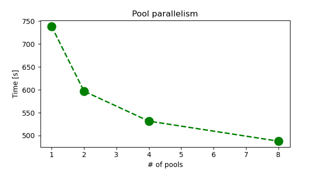

# Exercise 2: optimize CPU execution

In this section you will learn how to run calculations using QE on an HPC facility,
trying to optimize the time to solution. 

------------------------------------------------------------------------

Let's go to the exercise2 folder in your $CINECA_SCRATCH directory

~~~~~{.bash}
cd $CINECA_SCRATCH  
cd Day-9/exercise2.CPU-tests/
~~~~~

------------------------------------------------------------------------

## 1. Pool parallelism

Optimize the number of kpoint pools, starting with 1 up to 8 (what are the admissible values for this option?). 
The jobscript file to be used on Marconi100 is already available in this folder and is also reported below for your convenience.

------------------------------------------------------------------------

#!/bin/bash
#SBATCH --nodes=1              # number of nodes
#SBATCH --ntasks-per-node=16   # number of MPI per node
#SBATCH --cpus-per-task=4      # number of HW threads per task (equal to OMP_NUM_THREADS*4)
#SBATCH --mem=230000MB
#SBATCH --time 00:30:00        # format: HH:MM:SS
#SBATCH --reservation=s_tra_qe
#SBATCH -A tra21_qe
#SBATCH -p m100_usr_prod 
#SBATCH -J qeschool

module load    hpc-sdk/2020--binary    spectrum_mpi/10.3.1--binary   fftw/3.3.8--spectrum_mpi--10.3.1--binary  

export QE_ROOT=/m100_scratch/usertrain/a08trd1f/Day-9/exercise1.CPU-setup/qe-cpu/

export PW=$QE_ROOT/bin/pw.x

export OMP_NUM_THREADS=1

mpirun  ${PW} -npool 1 -ndiag 1 -inp pw.CuO.scf.in | tee pw.CuO.scf.npool01.ndiag01.log 

------------------------------------------------------------------------

1. First, **submit the job as is**, with npool set to 1 with the command  "sbatch job.sh"

2. You can check the status of the job with the command "squeue  -u USER". 
   Check the ST (status) field, R means "running", otherwise the job is still waiting to be processed.

   In case you want to cancel the job execution, you can run "scancel JOBID", where JOBID it returned by the "squeue  -u USER" command.

3. When the job is finished check the output file. You should find the execution time at the bottom of the file:

    PWSCF        :   5m53.84s CPU   5m58.18s WALL

the WALL time is the value you want to note down 
(the CPU time is the amount of time spent by the CPU processing `pw.x` 
instructions, which is a considerable portion of the whole execution time,
but neglects, for example, I/O. 
For more details [check wikipedia](https://en.wikipedia.org/wiki/CPU_time)).

4. Then, **open the job-script file** (`job.sh`) and **change the number of pools to be used `-npool X`**, with X={2,4,8}. Don't forget to rename the output file accordingly.

3. **Collect the WALL time** as a function of the number of pools.

------------------------------------------------------------------------

You should be able to produce a plot similar to this one:



Congrats! With the same computational resources, the time to solution is reduced by 1/3!

------------------------------------------------------------------------

Please consider that pool parallelism could be much more effective than this, especially when the system size is larger and calculations are distributed among multiple nodes, 
since it can strongly reduce the slow inter-node communications.

------------------------------------------------------------------------

## 2. Parallel diagonalization

In this second part we want to speedup the code by solving the dense eigenvalue problem using more than one core. 

1. Open the job.sh script file and **Set `-npool` to 4 and activate parallel diagonalization by changing `-ndiag 4`** to improve the performance.

2. submit the job again with the sbatch command

3. Inspect the beginning of the output file and look for this message

```
Subspace diagonalization in iterative solution of 
the eigenvalue problem:
one sub-group per band group will be used
custom distributed-memory algorithm 
(size of sub-group:  2*  2 procs)
```

and check the WALL time.

------------------------------------------------------------------------

3. Check the time to solution. 

In this exercise we showed an easy way to use the parallel diagonalization, exploiting the internal -- suboptimal -- QE libraries. 

However, you might not be able to observe significant speedups since:

1. the eigenvalue problem is too small to take fully advantage of it,
2. the internal QE libraries are suboptimal, whereas other libraries, e.g. Scalapack or ELPA, usually provide better performance. 

Please keep in mind that for larger systems, and using optimized libraries, the parallel diagonalization is a powerful option to strongly reduce the computational time to solution. 

