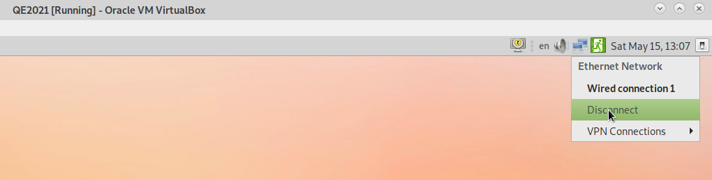
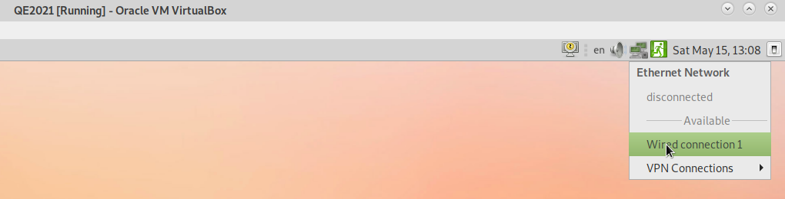

# How to restart the network in the QE-2021 virtual-machine

If network hangs by some reason (for example due to *openconnect*) it
can be restarted by disabling and enabling it in the network-manager
applet (icon  on the right of the desktop
top-panel) as shown here:

